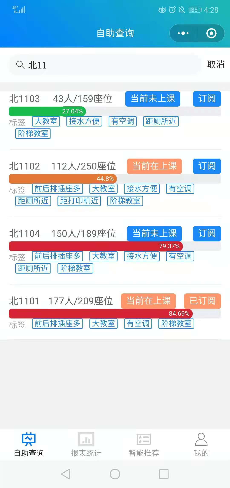

# AI 自习室

<div align="center">
  
</div>

该项目旨在针对高校学生在自习高峰时段常奔波于各教室却苦于找不到心仪教室以及座位等问题进行初步解决，通过微信小程序方便快捷查询实时教室空闲情况，教室占用率会根据排课信息和计算机视觉算法动态修正，将教室视作商品，用户可根据自己的兴趣对自己偏爱的教室类型打上标签权重，系统可根据用户查询教室历史和用户给定标签权重，以及教室标签和实时占用数据，智能推荐用户偏爱的教室。

## 项目背景

- 高校学生在自习或上课高峰阶段常奔波于各教室却找不到心仪教室和座位
- 当前用户主要使用产品教务系统存在空教室查询繁琐且经常出现异常，存在没有经常维护系统和改进系统的现象
- 高校考研和经常自习的学生日益增多，教室资源难以维护、学生自习问题愈发突出

## 技术栈

- 前端：Vant Weapp 组件库、ColorUI 样式库、Echarts 图表绘制
- 后端：SSM(Spring、Spring MVC、MyBatis) + MySQL
- 算法：YOLOv5 用于人头检测模型训练，基于标签方式解决传统的基于内容的推荐算法的冷启动问题

<div align="center">
  
  
  
</div>

## 功能

- 微信一键登录
- 模糊查询教室，包括教室名称、楼栋、楼层、座位数、识别人数、占用率(根据实时数值进行可视化：绿色、橙色和红色)、当前是否在上课、是否已订阅、教室标签等基本信息
- 根据日期和时间查询某栋教学楼未排课的教室，同时显示上述基本信息
- 实时教室动态变化柱状图
- 查看已订阅教室的基本信息
- 查看系统根据用户偏爱和实时情况推荐的教室
- 对系统已给定标签打上偏爱程度

## 项目结构

```txt
.
├── README.md
├── api # 后端SSM接口
├── assets # 图片和视频等静态资源
├── docs # 项目文档
├── presentation_lite.pptx # 项目演示PPT简短
├── presentation_normal.pptx # 项目演示PPT详细
├── weapp # 小程序前端页面
└── yolo # YOLOv5目标检测模型训练代码和数据集

6 directories, 3 files
```

## 演示

YOLOv5 实时检测[详情见 Wandb](https://wandb.ai/xiezicong/YOLOv5/)和数据库实时更新：

https://github.com/XIRZC/ai.clsrm/assets/48874620/157c797b-f2c6-4e24-8329-ccece7598877

微信小程序实时查询、推荐和订阅演示：

https://github.com/XIRZC/ai.clsrm/assets/48874620/3c37eb15-298d-40a5-8698-085eb4512ffe

## 其他

YOLOv5 测试指标和结果可视化：

<div align="center">
  
  
</div>

小程序各页面截图：

<div align="center">
  
  
  
  
  
</div>
